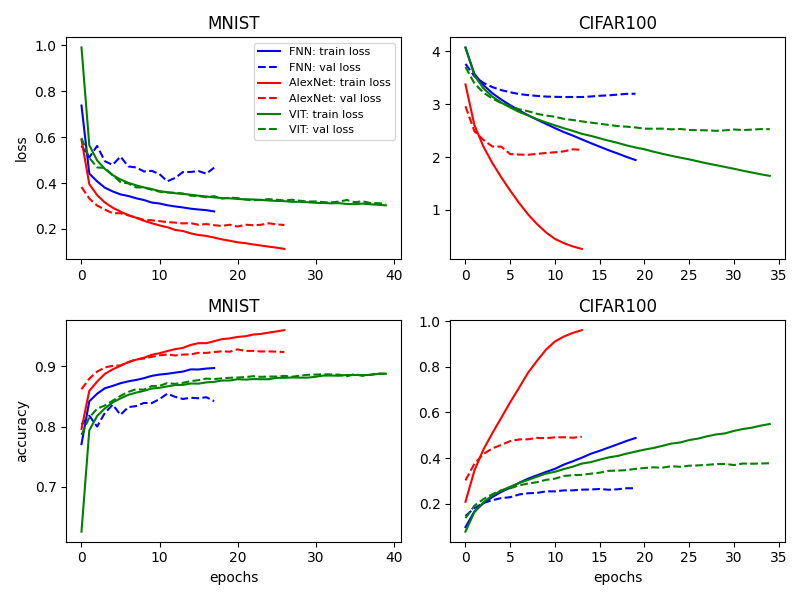
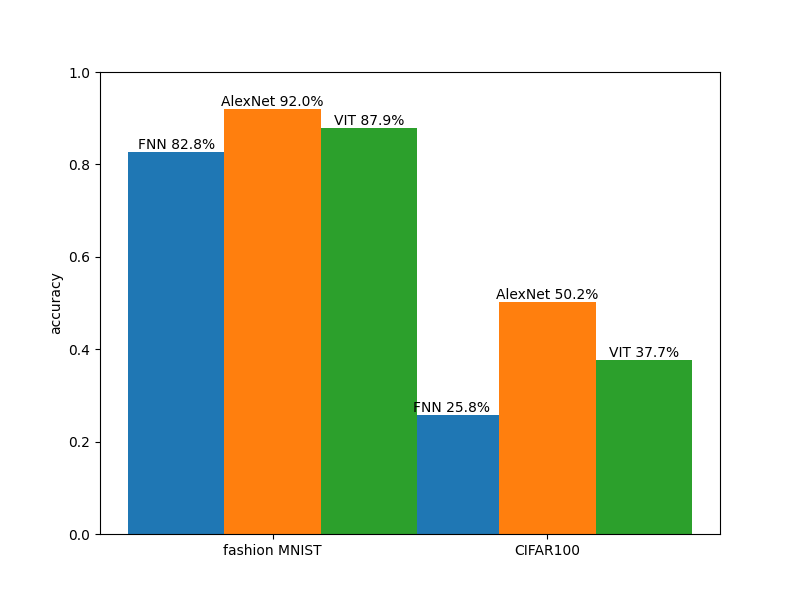

Simple repository for myself to get familiar with various computer vision models and compare their performance on common benchmarks.  


## Goal

We consider three models in `src/models.py`:

a) **FNN**: A simple forward network a couple of layers deep.

b) **AlexNet**: Not the actual AlexNet (original AlexNet is way too large for current datasets) but a CNN structure inspired from it.

c) **VIT** (VisionTransformer): The vision transformer as proposed by Dosovitskiy et al., model code used from https://github.com/phlippe/uvadlc_notebooks.

After tuning the hyperparameters of the models we compare their performance of the following to common benchmarks:

a) **Fashion MNIST**: Outdated benchmarking dataset but a useful sanity check.

b) **CIFAR100**: Commonly used dataset for benchmarking. In the absence of additional training data current SOA seems to be around ~85-90% accuracy (P. Foret et al. arXiv:2010.01412).

## Usage

1) Create venv and install requirements:

```python
    python3 -m venv venv
    pip install -r requirements.txt 
```

2) Hyperparam turning and training best models datasets (fashion MNIST is default):
```python
    make tune_and_train_all_MNIST
    make tune_and_train_all_CIFAR100
```
3) Visualize results:
```python
    make make_figures
```

To play around with the models and params yourself in MLFlow, see `experiments/train_explore`


## Results

For the optimal parameters the training runs yield:



On the final test set, we can see that the AlexNet-inspired model yields best results. Out of the considered models it is the only one using inductive bias about the spatial ordening of the pixels on the image. In light of CIFAR being a very small dataset it should not come as a surprise for such a model to be the best. As can be seen in Dosovitskiy et al. (https://arxiv.org/abs/2010.11929), vision transformers shine on CIFAR once additional data is used for pretraining.



